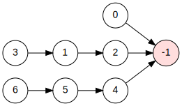
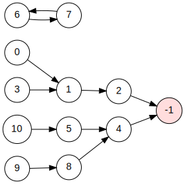
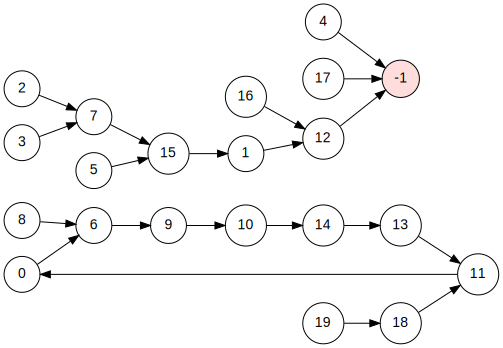
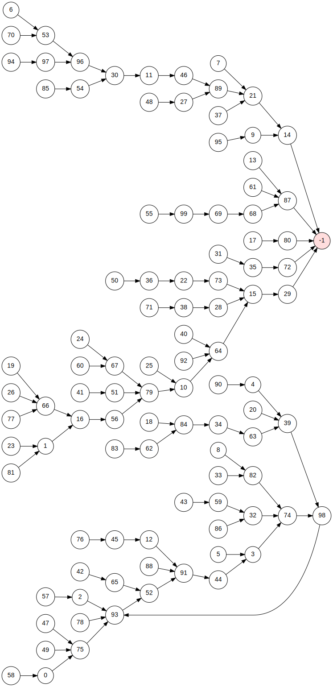
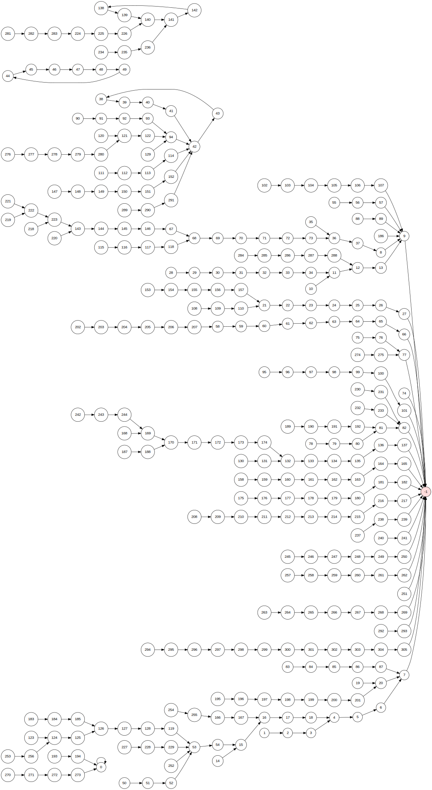
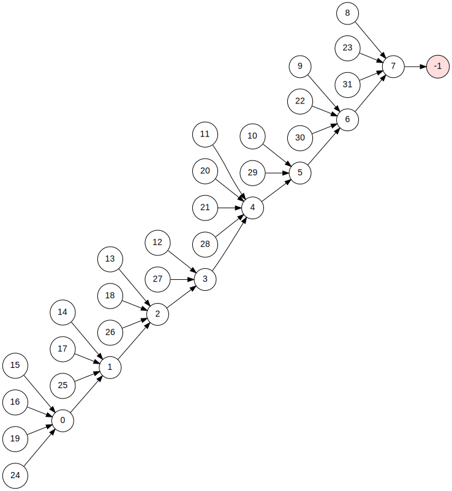

# fatsim

###

Returns the blocks the largest files stored in a FAT(FILE ALLOCATION TABLE); Starter blocks of longest chain of files.
-1 represents a null pointer and the end of a file.

# results for test files in `tests` subdirectory

## `tests/fat1.txt`



```
$ cat tests/fat1.txt
-1 2 -1 1 -1 4 5

$ ./fatsim < tests/fat1.txt
FAT has 7 entries.
blocks: 3 6
elapsed time: 0.00s
```

## `tests/fat2.txt`



```
$ cat tests/fat2.txt
1 2 -1 1 -1 4 7 6 4 8 5

$ ./fatsim < tests/fat2.txt
FAT has 11 entries.
blocks: 0 3 9 10
elapsed time: 0.00s
```

## `tests/fat3.txt`



```
$ cat tests/fat3.txt
  6 12  7  7 -1 15  9 15  6 10
 14  0 -1 11 13  1 12 -1 11 18

$ ./fatsim < tests/fat3.txt
FAT has 20 entries.
blocks: 2 3
elapsed time: 0.00s
```

## `tests/fat4.txt`


```
$ cat tests/fat4.txt
-1 -1 -1 -1 -1 -1 -1 -1 -1 -1 -1 -1

$ ./fatsim < tests/fat4.txt
FAT has 12 entries.
blocks: 0 1 2 3 4 5 6 7 8 9 10 11
elapsed time: 0.00s
```

## `tests/fat5.txt`


```
$ cat tests/fat5.txt
1 2 9 10 3 11 4 14 7 13 15 0 5 8 6 12

$ ./fatsim < tests/fat5.txt
FAT has 16 entries.
blocks:
elapsed time: 0.00s
```

## `tests/fat6.txt`


```
$ cat tests/fat6.txt
8 1 2 3 13 1 15 7 8 2 7 11 3 13 11 15

$ ./fatsim < tests/fat6.txt
FAT has 16 entries.
blocks:
elapsed time: 0.00s
```

## `tests/fat7.txt`



```
$ cat tests/fat7.txt
75 16 93 74 39 3 53 21 82 14 64 46 91 87 -1 29 56 80 84 66 39 14 73 1
67 10 66 89 15 -1 11 35 74 82 63 72 22 21 28 98 64 51 65 59 3 12 89 75
27 75 36 79 91 96 30 99 79 2 0 32 67 87 84 39 15 52 16 79 87 68 53 38
-1 15 98 93 45 66 93 10 -1 1 74 62 34 54 32 -1 91 21 4 44 64 52 97 9
30 96 93 69

$ ./fatsim < tests/fat7.txt
FAT has 100 entries.
blocks: 6 19 23 26 70 77 81 94
elapsed time: 0.00s
```

## `tests/fat8.txt`



```
$ ./fatsim < tests/fat8.txt
FAT has 306 entries.
blocks: 219 221 253
elapsed time: 0.00s
```

## `tests/fat9.txt`



```
$ ./fatsim < tests/fat9.txt
FAT has 32 entries.
blocks: 15 16 19 24
elapsed time: 0.00s
```

## `tests/fat10.txt`

```
$ ./fatsim < tests/fat10.txt
FAT has 45001 entries.
blocks:
elapsed time: 11.12s
```

## `tests/fat11.txt`

```
$ ./fatsim < tests/fat11.txt
FAT has 45001 entries.
blocks: 14602
elapsed time: 5.58s
```

## using `rngfat.py`

```
$ ./rngfat.py 10000000 35 | ./fatsim
FAT has 10000000 entries.
blocks: 2604616 9839077
elapsed time: 3.04s
```
